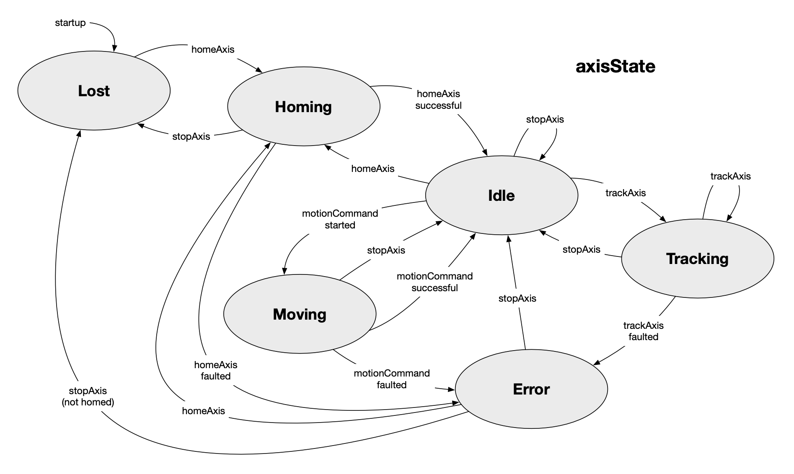

# GalilMotion HCD

The GalilMotion HCD implements the CSW Hardware Control Daemon interface for Galil
DMC-400x0 and DMC-500x0 motion controllers. It manages embedded program execution,
state monitoring, error detection, fault recovery, and CSW event publishing for axes
configured as either linear or rotating mechanisms.

It is built on Scala 3, Apache Pekko, and CSW 6.0, and talks to the controller over
TCP using the `galil-io` wire protocol. The HCD also serves a single-file browser HMI
for standalone bring-up and testing, with no separate web server.

For the authoritative design specification see the GalilMotion HCD Software Design
Description (SDD); this README is a self-contained overview for working in the code.
See the [CSW documentation](https://tmtsoftware.github.io/csw/6.0.0/) for how HCDs are
defined and used in the TMT software architecture.

---

## Build, Run, and Test

### Build

```bash
sbt stage
```

### Run with the simulator

`GalilHcdSim.conf` registers the component under a distinct prefix
(`aps.ICS.HCD.GalilMotion.Sim`) to avoid Location Service conflicts with a hardware
instance.

```bash
# Terminal 1: CSW Location Service
csw-services start

# Terminal 2: Galil simulator
sbt "galil-simulator/run"

# Terminal 3: build and launch the HCD
sbt stage
./target/universal/stage/bin/galil-hcd \
  -main csw.proto.galil.hcd.GalilHcdApp \
  --local galil-hcd/src/main/resources/GalilHcdSim.conf \
  -Dgalil.config.path=GalilHcdConfig-Simulator.conf
```

### Run against hardware

```bash
# Terminal 1: CSW Location Service
csw-services start

# Terminal 2: build and launch
sbt stage
./target/universal/stage/bin/galil-hcd \
  -main csw.proto.galil.hcd.GalilHcdApp \
  --local galil-hcd/src/main/resources/GalilHcd1.conf \
  -Dgalil.config.path=GalilHcdConfig-Hardware.conf
```

`-Dgalil.config.path` selects the application config (controller connection, axis
layout, polling, simulation mode). If unset, the HCD loads `GalilHcdConfig.conf`
(simulator mode). See [Configuration](#configuration) for the full list.

### HMI

The HCD serves the HMI itself; just open the URL once the HCD is running.

| Mode | HMI URL | Controller |
|------|---------|------------|
| Simulator | `http://localhost:9090` | GalilSimulatorApp at 127.0.0.1:8888 |
| Hardware (id=1) | `http://localhost:9091` | DMC-500x0 at 192.168.86.41:23 |

The HMI port is `9090 + controller.id` in every mode (`controller.id` is 0..N; the
default simulator config uses id 0, so it serves on 9090). The CSW prefix is set by
the container conf and is independent of `controller.id`.
See [HMI](#hmi) for what the console provides.

**CPU-load badge (REQ-2-APS-0621).** The HMI header shows this HCD JVM's live CPU usage
(process % vs the 70% ceiling, green/amber/red), read in-process from the monitor. The HCD
also publishes a **`cpuLoad`** SystemEvent at 1 Hz (`processCpuLoad` / `systemCpuLoad`
fractions, `availableProcessors`, `pid`, `hostname`) via `CpuLoadMonitor` — declared in the
HCD `publish-model.conf` / `GalilMotionKeys`. The assembly container publishes the same event
as `APS.ICS.IcsAssemblies.cpuLoad`; `AssemblyLoadApp` sums them per host against the 70% ceiling.

### Tests

Most suites need no hardware and no CSW services.

```bash
# Pure unit tests (no hardware, no CSW services)
sbt "galil-hcd/testOnly *ConfigTest *InternalStateActorTest *ControllerStatusActorTest \
  *CommandHandlerActorTest *CommandWatcherActorTest *LongRunningCommandTest \
  *RotatingMechanismTest *AxisStateValidationTest *IOTest *CommandGateTest \
  *ProgramFileManagerTest"

# Controller/simulator-dependent (no CSW services)
sbt "galil-simulator/run"   # in a separate terminal
sbt "galil-hcd/testOnly *ControllerCommandActorTest"        # 16 tests
sbt "galil-hcd/testOnly *CurrentStatePublisherActorTest"    # 4 tests (simulator only)

# Integration (uses FrameworkTestKit; csw-services must NOT be running)
sbt -Dgalil.config.path=GalilHcdConfig-Simulator.conf \
    "galil-hcd/testOnly *HcdIntegrationTest"                # 17 tests

# Simulator behaviour
sbt "galil-simulator/testOnly *GalilSimulatorActorTest"     # 104 tests
```

| Suite | Tests | Dependencies | Coverage |
|-------|------:|--------------|----------|
| GalilHcdConfigTest | 10 | none | Config parsing, countsPerRevolution, 8-axis default config |
| InternalStateActorTest | 84 | none | State management, pub/sub, motorPosition/motorDemand/angularPosition, ConnectionStatus, EnterFaulted transitions, trackingSession invariant, thread-0 registry attribution (S86) |
| ControllerStatusActorTest | 30 | none | QR polling, adaptive rate, AI polling, `_XQ<n>` synthesis, `ScanObservations` shipping, `ae[]` startup gating |
| CommandHandlerActorTest | 16 | none | Immediate commands, validation, faultReset gating |
| CommandWatcherActorTest | 16 | none | Completion mask evaluation (incl. the S86 thread-0/-1 sentinel regression) |
| EightAxisThreadingTest | 4 | none | Full-pool allocation via a pool-faithful CI mock (real `selectThread`, `forceThread` honored): thread-0 lend-last, scan-gated thread-0 completion, thread-0 interrupt-reuse (S86) |
| LongRunningCommandTest | 34 | none | Motion handlers; trackAxis PVT internals (ΔP/V/T, deg→counts, 0/360 wrap, bound and velocity guards) |
| RotatingMechanismTest | 26 | none | Approach algorithm, positionWheel, offsetAxis, no-cpr fallback |
| AxisStateValidationTest | 14 | none | State machine rules, interruption mechanics, stopCompletionState(homed) |
| IOTest | 17 | none | DIO bit extraction, setBit/clearBit dispatch, AI polling |
| CommandGateTest | 19 | none | Shared command-gate checks and CSW/HMI parity |
| ProgramFileManagerTest | 14 | none | DL upload prep (REM/blank strip, 80-char compression and guard), LS-download parsing |
| ControllerCommandActorTest | 19 | hardware or simulator | Command-socket protocol |
| CurrentStatePublisherActorTest | 4 | simulator | CurrentState publishing |
| HcdIntegrationTest | 18 | hardware or simulator + FrameworkTestKit | End-to-end command lifecycle, incl. 8 concurrent moves occupying threads 0-7 (8-axis config) |
| GalilSimulatorActorTest | 104 | none | Simulator behaviour, incl. busy-thread XQ rejection (S86) |
| **Total** | **429** | | |

The HCD depends on `galil-io` for the controller wire protocol. That module has its
own suite (`galil-io/GalilIoTest`, 45 tests) covering `writeRaw`, `send` (single and
compound), `sendAndWaitForPrompt`, `downloadProgram`, `uploadProgram` (including the
DL `?`-rejection path and read-timeout save/restore), `chunkCompound`, and the
80-character line guard. Run with `sbt "galil-io/test"`.

---

## Configuration

The HCD uses two layers of configuration:

1. **CSW container config** (`GalilHcd1.conf` / `GalilHcdSim.conf`): component
   registration, passed to `ContainerCmd` with `--local`. This is the sole
   authoritative source of the CSW prefix and component identity.
2. **HCD application config** (`GalilHcdConfig*.conf`): controller connection, axis
   setup, polling rates, and simulation mode. Selected via the `-Dgalil.config.path=`
   system property.

### Config files (`src/main/resources/`)

| File | Purpose |
|------|---------|
| `GalilHcd1.conf` | CSW container config (hardware registration: `aps.ICS.HCD.GalilMotion.1`) |
| `GalilHcdSim.conf` | CSW container config (simulator; distinct prefix `aps.ICS.HCD.GalilMotion.Sim`) |
| `GalilHcdConfig.conf` | Default HCD config (simulator mode) |
| `GalilHcdConfig-Simulator.conf` | Simulator at 127.0.0.1:8888 (lab axis layout) |
| `GalilHcdConfig-Hardware.conf` | Lab DMC-500x0 (DMC-50040, 4 axes) at 192.168.86.41:23 |
| `GalilHcdConfig-STB.conf` | STB DMC-4080 (8 channels, 7 active axes A-G) at 192.168.42.100:23 |
| `GalilHcdConfig-STBsim.conf` | Simulator at 127.0.0.1:8888 with the STB axis layout |

### Controller config structure

```hocon
controller {
  host = [192, 168, 86, 41]      # IP as integer array
  port = 23                       # TCP port
  id = 1                          # controller instance id (HMI port = 9090 + id)
  embeddedProgram = "protoHCD_lab.dmc"
  standbyPollingRateHz = 1.0      # QR rate when all axes idle
  actionPollingRateHz = 10.0      # QR rate when any axis active
}

simulate = false                  # true for simulator mode

# 8 booleans for axes A-H; reflects physical wiring, not controller model
activeAxes = [true, true, false, false, false, false, false, false]

axes {
  A {
    mechanismType = "linear"      # "linear" or "rotating"
    upperLimit = 1000.0           # soft limit (counts)
    lowerLimit = 0.0
    inPositionThreshold = 5.0     # position tolerance (counts)
    indexOffset = 0.0
  }
  B {
    mechanismType = "rotating"
    algorithm = "shortest"        # "forward" | "reverse" | "shortest"
    countsPerRevolution = 400     # integer counts for one full 360-degree revolution
    upperLimit = 360.0
    lowerLimit = 0.0
    inPositionThreshold = 1.0
    indexOffset = 0.0
    # Optional: overwrite controller EEPROM defaults
    maxSpeed = 1000.0             # counts/sec
    acceleration = 9216.0         # counts/sec^2
    deceleration = 9216.0
    motionDelay = 100.0           # post-move settling time (ms)
    indexSpeed = 256.0            # homing speed (counts/sec)
  }
}
```

For rotating axes, `countsPerRevolution` is the integer number of counts for one full
360-degree revolution, and must be a whole number for stepper motors (a 400-step/rev
stepper uses `countsPerRevolution = 400`). Both hardware and simulator configs use
`cpr = 400` so integration tests behave identically on both. The HCD writes this value
to the embedded `cpr[]` array at initialization via `writeMotionConfig()`; the embedded
`#SelectX` programs use `cpr[idx]` for exact integer slot arithmetic.

---

## Architecture

The HCD is hosted by the `GalilHcd` CSW component, which implements the lifecycle
handlers, spawns the actors below, hosts the HMI, and orchestrates fault recovery.

It uses three independent TCP connections to the controller, all on the same port (the
DMC-500x0 assigns each to one of its 8 Ethernet handles internally). The three
connection-owning actors are spawned as siblings directly under `GalilHcd`; none is a
child of another.

| Actor | Connection | Role |
|-------|-----------|------|
| `ControllerCommandActor` | command socket | SendCommand, ExecuteProgram, HaltExecution, init-time `TC 1`, thread allocation |
| `ControllerStatusActor` | status socket | QR polling, per-thread `MG _XQ<n>`, `MG ae[]` reads, AI polling, runtime `TC 1` |
| `ControllerConsoleActor` | console socket | Unsolicited MG output via `CF I` (hardware only) |

Separating command from status traffic means QR/AI polls never contend with command
traffic at either the socket or the actor-mailbox level. Each actor reports its
connection status to `InternalStateActor` on startup via `ReportConnectionStatus`.
`HcdState.isOperational` is true when both the command and status connections are
Connected; the console connection is informational and does not affect readiness.

The internal actors that orchestrate the rest:

- **InternalStateActor** is the central state repository with two notification
  channels: `StateChanged` (HCD and AxisState) and `CmdStateChanged` (AxisCmdState
  only, used by CommandWatchers). It owns the `EnterFaulted` transition logic.
- **CommandHandlerActor** dispatches CSW commands and spawns one
  `CommandWatcherActor` per long-running command.
- **CommandWatcherActor** subscribes to `CmdStateChanged` for its axis and
  `StateChanged` for the HCD, and reports completion, failure, or timeout to the CRM.
- **CurrentStatePublisherActor** publishes CSW CurrentState events for the HCD and
  per-axis updates.

The browser-side HMI infrastructure:

- **HmiServer** (Pekko HTTP): WebSocket `/ws/state`, REST `POST /api/command`,
  `GET/POST /api/loglevel`.
- **HmiJsonProtocol**: serializes `HcdState` to JSON.
- **HmiLogAppender**: routes all CSW log output (including Galil MG console output) to
  the WebSocket.
- **index.html**: single-file React SPA (vanilla `createElement`, no build step), at
  `src/main/resources/web/index.html`.

A command flows: CSW `validateCommand` (or `HmiServer.handleCommandRequest`) gates it
through the shared `CommandGate`, `CommandHandlerActor` dispatches it to
`ControllerCommandActor`, a `CommandWatcherActor` tracks long-running completion via
`InternalStateActor`, and the final response returns through the Command Response
Manager (CRM).

---

## CSW Commands

### Immediate commands

- **configAxis**: set motion parameters (speed, acceleration, deceleration, motion
  delay, index offset, index speed, inPosition threshold).
- **configLinearAxis**: configure the axis as linear with soft limits.
- **configRotatingAxis**: configure the axis as rotating with an approach algorithm.
- **setBit**: set or clear a digital output bit. Parameters: `address` (int, 1-based
  per Galil convention), `value` (int: 1 = set, 0 = clear). Sends `SB n` or `CB n`.
- **setAO**: set an analog output channel. Parameters: `address` (int), `value` (float).
- **faultReset**: recover from a Faulted HCD state. Parameter: `severity`
  (`None`, `Init`, `Reset`, `Reload`). See [Fault Recovery](#fault-recovery).

### Long-running commands

| Command | Description | Completion condition |
|---------|-------------|----------------------|
| **positionAxis** | Move to an absolute count position | Idle, inPosition, thread released |
| **offsetAxis** | Move by a relative distance | Idle, inPosition, thread released |
| **homeAxis** | Home axis to reference | Idle, not moving, thread released |
| **stopAxis** | Halt active motion | Idle (or Lost), not moving, thread released |
| **selectWheel** | Position to a discrete slot (0-7) | Idle, inPosition, thread released |
| **positionWheel** | Position to an angular demand (degrees) | Idle, inPosition, thread released |

Move commands compute physics-based timeouts from the axis motor configuration
(trapezoidal velocity profile with a 2x safety factor, 3-second minimum).

### Immediate PVT-streaming command

| Command | Description | Completion |
|---------|-------------|-----------|
| **trackAxis** | Stream one PVT segment (`PV<x>=ΔP,V,T` plus initial `BT<x>`) | Completed on FIFO acceptance |

`trackAxis(axis, position, rate, validTime)` is the per-segment primitive for
HCD-orchestrated tracking. Each call writes one PVT segment to the controller's per-axis
FIFO; the controller does cubic-Hermite interpolation between segments to produce a
smooth trajectory. The Assembly streams these at roughly 1 Hz (with FIFO slack), and the
HCD owns the absolute-to-relative conversion and underrun monitoring. The tracking
session is a state in InternalStateActor (`axisState = Tracking` plus a `trackingSession`
ledger), not a long-running CSW command lifecycle. See [Tracking](#tracking).

When the HCD is Faulted, every command except `faultReset` is rejected with
`Invalid(OtherIssue("HCD Faulted: <msg>"))`. The check is enforced both in CSW
`validateCommand` and in `HmiServer.handleCommandRequest` (the HMI bypasses CSW
validation by going directly to `CommandHandlerActor`). Both paths share one set of pure
checks (`CommandGate`: HCD-state, axis-state-machine, soft-limit), so the HMI rejects
axis-state-machine violations synchronously too, under the same rules as CSW, minus the
HMI-only engineering escapes (`setSoftLimits`, engineering jog/stop).

### Rotating-axis approach algorithm

For rotating axes with `countsPerRevolution` configured, `positionAxis`, `offsetAxis`,
and `positionWheel` apply an approach algorithm that resolves the correct absolute count
target:

- **forward**: always approach from below (add one revolution if needed).
- **reverse**: always approach from above (subtract one revolution if needed).
- **shortest**: take whichever arc is shorter.

`positionWheel` converts the angular demand in degrees to counts via
`rawTarget = (angleDeg / 360.0) * countsPerRevolution`, then applies the approach
algorithm identically to `positionAxis`. It is rejected if the axis is not configured as
Rotating or if `countsPerRevolution` is not set. `selectWheel` does not use the approach
algorithm; it delegates to the embedded `#SelectX` program.

---

## Axis State Machine



*Per-axis state transitions (SDD Figure 4-2). `motionCommand` stands for `positionAxis`,
`offsetAxis`, `selectWheel`, or `positionWheel`. While `Moving`, a new `motionCommand`
interrupts the active move and stays in `Moving`.*

A per-axis `homed: Boolean` flag distinguishes `Error → Lost` from `Error → Idle`:

- `homed = false` initially, and is re-cleared at the start of every `homeAxis` attempt.
- `homed = true` is set atomically with `axisState = Idle` when `homeAxis` completes
  successfully.
- `stopAxis` from `Error` returns to `Idle` if the axis has a valid home reference, or to
  `Lost` if the home attempt itself failed.

Error is the latch for any fault. A home failure transitions `Homing → Error` (via
`ControllerStatusActor.reportAxisError` when `ae[i] != 0`), and the recovery state out of
Error depends on whether a valid home reference exists, which is what `homed` records.

---

## Embedded Programs

Program sources live in `src/main/resources/programs/`: `protoHCD_lab.dmc` (lab
DMC-500x0) and `galilHCD_STB.dmc` (STB DMC-4080).

| Label | Purpose |
|-------|---------|
| `#Init` | Controller initialization (motor off, create arrays, set defaults) |
| `#SetupA`-`#SetupH` | Per-axis hardware config (motor type, limits, amplifier, BZ commutation) |
| `#MoveA`-`#MoveH` | Absolute position move (PA mode) |
| `#HomeA`-`#HomeH` | Home sequence |
| `#StopA`-`#StopH` | Controlled stop |
| `#SelectA`-`#SelectH` | Discrete 8-position wheel: `PA = dmd[idx] * (cpr[idx] / 8)` |
| `#POSERR`, `#LIMSWI`, `#MCTIME`, `#CMDERR` | Controller-invoked fault handlers |

Tracking has no embedded program; `trackAxis` is implemented in the HCD as direct PVT
segment writes to the controller's per-axis FIFO (see [Tracking](#tracking)).

**Key embedded arrays:**

- `cpr[8]`: counts per revolution (integer; written by HCD `writeMotionConfig()`).
- `dmd[8]`: demand/target (counts for move; slot number 0-7 for select).
- `speed[]`, `accel[]`, `decel[]`, `hspd[]`, `hoff[]`, `mdelay[]`: motion parameters.
- `ae[8]`: per-axis error code, populated by both motion programs and fault handlers.

### `ae[]` convention

Every motion program (`#HomeX`/`#MoveX`/`#SetupX`/`#StopX`) sets `ae[axis] = 1` on entry
and clears `ae[axis] = 0` only on the success path. Any abort (`#CMDERR` killing the
thread, or an error handler exiting via `RE`/`RE1`) leaves `ae[axis] = 1` (program
error). The fault handlers may also set `ae`:

- `#POSERR` sets `ae[axis] = 2` (position error exceeded limit).
- `#LIMSWI` sets `ae[axis] = 3` (limit switch hit during motion).
- `#MCTIME` sets `ae[axis] = 4` (motion completion timeout).

`#StopX` programs also set `ae[axis] = 0` for consistency and to clear the error latch on
operator recovery.

### Thread management

Threads 1-7 are allocated dynamically by the HCD for per-axis motion commands;
allocation reads `MG _NO` to find an unused thread. Thread 0 — home of the automatic
subroutines (`#POSERR`, `#LIMSWI`, `#MCTIME`) and of `#Init`/`#Setup`/`#AUTO` — is lent
out as a **last resort** when threads 1-7 are all in use, so a fully-populated 8-motor
controller can move every axis simultaneously (S85; policy in
`ControllerCommandActor.selectThread`). Notes on the last-resort case:

- An automatic subroutine firing while a motion program occupies thread 0 interrupts it
  and resumes it on `RE` (Galil interrupt semantics). The motion itself is
  profiler-driven, so the suspension only delays the program's monitoring/completion —
  but this interrupt-resume behavior is queued for empirical STB verification before
  8-motor operation is relied upon.
- A handler running on an *idle* thread 0 sets `_NO` bit 0, so the allocator correctly
  sees it hardware-busy for the handler's duration.
- `#Init` is allocated dynamically like any program (it does NOT run on thread 0);
  only `#Setup` runs on the literal thread 0. A `faultReset` re-init issued while a
  last-resort motion occupies thread 0 fails cleanly at `XQ #Setup,0`; stop axes and
  retry.

Per-thread state uses `MG _XQ<n>`, not `MG _NO` or the QR `threadStatus` byte. When one
thread is mid-motion and another thread's program is killed by `#CMDERR`, both `_NO` and
the QR byte continue to report the dead thread as active for many seconds, until
unrelated controller activity settles. Per-thread `_XQ<n>` returns the line number
currently executing, or `-1` if the thread has stopped, and is reliable.
`ControllerStatusActor` synthesizes the per-scan thread bitmask from `_XQ<n>` queries
each scan, falling back to the raw QR byte only when the per-thread query fails (parse
error, or a simulator without `_XQ` support).

**Halt-time marking (ADR-001):** when `CommandHandlerActor.checkAndInterrupt`
deliberately halts an axis's thread via `HX` (the SDD 4.8.1 interruption protocol for
`positionAxis`/`stopAxis`/`offsetAxis`/`selectWheel`/`positionWheel` preempting an active
move or home), it sends `InternalStateActor.ThreadHalted(thread, axis)` as a synchronous
ask immediately after a successful `HX`. IS marks the registry entry **Halted** —
excluded from both completion and error attribution — and replies with
`ThreadHaltedAck`. Without this, the next scan would observe "current thread just
cleared, `ae[axis] == 1`, errorCode == 0" and fire the defensive `unexplainedAxes`
check against a program that was deliberately killed. The ack is a synchronization
point: the command handler waits for it before launching the follow-on program. On the
S84 reuse path the follow-on re-registers the SAME thread (Halted → Active,
`forceThread`), refreshing the freshness fence; without reuse, `UnregisterThread`
removes the entry and releases the reservation explicitly (a Halted entry has no other
exit — no scan will ever attribute it).

The thread is queried from IS's registry (`GetAxisThread`), never from
`AxisCmdState.activeThread` — display state that a watcher-timeout's
`clearActiveCommand` resets while the program still runs (S85 finding 4). The query
returns `Option[Int]`: `Some(0)` is a genuine thread-0 program and is halted like
any other; `None` means nothing to interrupt.

### Atomic XQ and thread confirmation

`ControllerCommandActor.ExecuteProgram` sends `XQ #label,N;MG _XQN` as a single compound.
The `MG` runs in the same line buffer as `XQ`, before any program execution can complete
or `#CMDERR` can fire, so a fast-completing or fast-failing program cannot end between the
`XQ` and a separate thread-state query.

---

## Tracking

The HCD implements tracking as direct PVT (Position-Velocity-Time) segment streaming to
the controller's per-axis FIFO. There is no embedded `#TrackX` program; `trackAxis` is an
HCD-orchestrated operation that talks PVT to the controller.

### Wire format

Per segment, the HCD writes `PV<axis>=ΔP,V,T`. The first segment of a tracking session
also issues `BT<axis>` to begin trajectory execution; subsequent segments need only the
`PV<axis>=` write, since the controller is already streaming through the FIFO.

| Wire | Meaning |
|------|---------|
| `PVA=ΔP,V,T` | A-axis PVT segment. The third letter is the axis (`PVB=` for B, and so on). There is no `PVAA=`. |
| `BTA` | Begin trajectory for axis A. The project convention is always per-axis; bare `BT` would start all axes with loaded segments. |
| `_PVA` | A-axis FIFO free-slot count (255 = empty, 0 = full). Segments in flight = `255 - _PVA`. |
| `_BTA` | A-axis segments executed since the most recent `BTA`. Resets on each new BT; not cumulative. |

### Per-segment lifecycle

`trackAxis(axis, position, rate, validTime)` from the Assembly:

1. **Validate** the envelope (axis, position, rate, validTime all present) and gate on
   `controllerSamplePeriodMicros > 0` (set at init from `MG _TM`).
2. **Convert** user units to counts: rotating axes use `value * cpr / 360` (integer
   arithmetic); linear axes are passthrough. For rotating axes the HCD also wrap-corrects
   the target to the shortest-arc equivalent in accumulated counts (the Assembly works in
   `[0, 360)` and has no notion of accumulated revolutions, so the HCD picks the
   whole-revolution shift nearest the previous endpoint; a `359° → 1°` step moves `+2°`,
   not `−358°`).
3. **Compute** `ΔP = positionCounts - prevEndpointCounts` and
   `T_samples = round((validTime - prevValidTime) / samplePeriod)`.
4. **Guard** the segment, rejecting before any wire write on: non-monotonic `validTime`;
   sub-sample `T_samples < 1`; PVA argument bounds (`|ΔP| ≤ 44e6`, `|V| ≤ 22e6`,
   `T ≤ 2048` samples, beyond which the controller rejects with `?` and faults the HCD);
   the configured per-axis velocity envelope (`maxSpeed`, checked against both the
   requested rate and the implied average velocity `|ΔP|/T`, the latter catching a
   far-from-target first segment that would slam the motor); and the degenerate `(0,0,0)`
   end-of-trajectory tuple.
5. **Write** the wire string: the first segment includes `;BT<x>`, subsequent segments are
   `PV<x>=` only.
6. **Update IS:** `axisState = Tracking`, `trackingSession = Some(TrackingSession(...))`,
   recording `lastTargetCounts`, `lastValidTime`, and `segmentsSubmitted`.
7. **Complete** with `crm.updateCommand(Completed(runId))` immediately on FIFO acceptance.
   No watcher is spawned; trackAxis is `completionType = immediate`.

The tracking session is a state in InternalStateActor, not a long-running CSW command
lifecycle. Per the invariant `axisState == Tracking ⇔ trackingSession.isDefined`, the
session is set by the first `trackAxis` from `Idle` and updated by subsequent calls in
`Tracking`. Clearing is enforced declaratively in `handleUpdateAxisState`: any transition
out of `Tracking` (stopAxis, fault, underrun, an embedded `#POSERR`/`#LIMSWI`/`#MCTIME`
error, or re-init) clears the ledger in the same update, so a stale ledger can never seed
the next session's ΔP/T.

### First-segment handling

When `trackAxis` arrives in `axisState = Idle`, there is no previous segment to base ΔP
on. The HCD uses the polled motor position as `prevEndpointCounts` and `Instant.now()` as
`prevValidTime`, so the first segment carries the motor from its current physical position
to the Assembly's first commanded position over the lead-time interval. `v_start = 0` is
implicit (the controller infers it from rest). The Assembly is responsible for the first
target being physically achievable.

### Stopping

`stopAxis` from `Tracking` bypasses `checkAndInterrupt` entirely (there is no embedded
thread to halt under PVT) and runs `#StopX` directly; `#StopX`'s `STx` drains the FIFO and
decelerates the motor to rest. `trackingSession` is cleared atomically with
`axisState → Idle` on success. For graceful trajectory termination
(decelerate-then-stop), the Assembly can submit a final
`trackAxis(axis, target, rate = 0, validTime)` to ramp velocity to zero before issuing
`stopAxis`.

### Underrun detection

When any axis is in `Tracking`, `ControllerStatusActor` adds `_PV<x>,_BT<x>` to its
QR-companion polls and forwards the readings to IS via `ReportPvtMonitoring`. IS checks
`observedAt > session.lastValidTime` per tracking axis; if true while the session is still
active, the axis transitions to `Error` with `axisError = "Tracking stream underrun"` and
`trackingSession` is cleared. Detection is preemptive: it fires before the controller's
FIFO physically empties (an empty FIFO would silently stop the motor with no error code).
The Assembly observes the fault via `CurrentStateAxis` and can react.

### Lead margin

Tracking submissions must arrive with `validTime` far enough in the future to keep the
FIFO non-empty between updates. The pattern used by `TrackInjectorApp` (the standalone lab
test client in `galil-client`) is `validTime = now + 1/cadence + leadMargin`, where
`leadMargin` is slack beyond the cadence period. At 1 Hz cadence with a 0.2 s lead margin,
each segment's `validTime` is 1.2 s in the future, leaving the FIFO with about one segment
of slack while the next update is in flight. Lead-margin policy will be specified in the
TCS-to-Assembly ICD; the HCD only enforces strict monotonicity of `validTime`.

---

## Error Detection and Fault State Machine

The HCD detects three classes of error and routes them through a uniform fault path.

### Per-axis error detection

Per-axis embedded program errors surface via `ae[]`. Each QR scan,
`ControllerStatusActor.handleQRResponse` runs the following pipeline:

1. Parse QR and snapshot the raw `threadStatus` byte and `errorCode` at one moment.
2. Stamp `observedAt` (monotonic `System.nanoTime`) immediately before the per-thread
   reads, then read `MG _XQ0..7` for ALL 8 threads unconditionally (single compound
   query; ADR-001 Amendment A) and synthesize a `threadStatus` byte from the results.
3. Read `MG ae[<idx1>],ae[<idx2>],...` for configured axes (single compound read). QR is
   read before the `ae` reads: the reverse order races with successful program endings
   (the program clears `ae = 0` after it is read but before QR shows the thread cleared,
   giving a stale `ae = 1` to misattribute). These reads stay suppressed until `#Init` has
   dimensioned the array, gated on a `SetEmbeddedArraysReady` flag that `runInitSequence`
   asserts only after `#Init` completes (and re-clears on every re-init). Reading an
   undimensioned `ae[]` makes the controller latch error 57, which on a cold boot (where
   `#AUTO` does not auto-run `#Init`) would otherwise surface as a spurious latch
   misattributed to the next `#Init`.
4. If `errorCode != 0`, eagerly fetch `TC 1` (consuming the hardware latch) so the text
   can travel with the observations.
5. Ship ONE `InternalStateActor.ScanObservations(threadStatusByte, observedAt, aeValues,
   errorCode, tcText)` message. CS makes **no attribution decisions** — it is a pure
   observer (ADR-001).
6. Push HCD-level updates (position, I/O, timing) and per-axis QR-derived updates
   (position, velocity, switches).

Attribution happens in `InternalStateActor.handleScanObservations`, against the
authoritative thread registry, under the single invariant (ADR-001 + Amendment A): a
registry entry participates only if it is not Halted AND its thread's bit is clear in
the scan AND `observedAt > registeredAt` (the freshness fence — a late-delivered scan
can never judge a thread incarnation newer than its own read). Within one handler,
errors are attributed BEFORE completions, so the watcher sees `axisErrorMsg` before
`activeThread → -1` and fails rather than completes:

- `ae[i] = 2/3/4` reports the axis as POSERR/LIMSWI/MCTIME (deduplicated via
  `lastReportedAxisError`).
- Controller-error evidence (fresh `errorCode`/TC text, or text held from last scan's
  deferral) with exactly one candidate axis (`ae = 1`, current thread observed-cleared)
  attributes to that axis (`axisErrorMsg = "Embedded program error: <TC text>"`,
  `axisState = Error`). Zero candidates defer one scan (the TC text is held in IS —
  the latch was already consumed); still-zero or 2+ candidates escalate to HCD-Faulted
  via `EnterFaulted` + `ST;MO` motor safing.
- Defensive case (`ae = 1`, current thread observed-cleared, no error evidence): treat
  as a per-axis Error. Halted registry entries (deliberately HX'd by
  `checkAndInterrupt`; see Thread Management) are excluded by the invariant, so a
  halted program's entry-time `ae == 1` residue is never misattributed.
- Completion attribution: each entry passing the invariant is removed, its CI
  reservation released (`ReleaseThread`), and the axis's `activeThread` set to **-1**
  (the no-thread sentinel; 0 is a valid thread number).

### Controller-level error detection

Two complementary paths surface controller error latches (`TC` codes):

- **Init-time** (`ControllerCommandActor.sendAndWaitForThread`): after every `XQ` plus
  thread-completion wait (for `#Init`, `#SetupX`, and so on), the HCD calls `TC 1` on the
  command connection. Nonzero sets `HcdState{state = Faulted, controllerErrorMsg = ...}`,
  logs at ERROR, and throws, propagating through `initFuture` to fail HCD startup cleanly.
- **Runtime** (`ControllerStatusActor`): per-axis attribution as described above.

`TC` reads clear the controller error latch.

### Connection loss detection

Each TCP-owning actor independently detects and reports its own connection failure to
`InternalStateActor`; no actor assumes the state of another's connection.

- `ControllerStatusActor`: on any `IOException` (including `SocketTimeoutException`,
  "Broken pipe") it stops polling and reports `statusConnection → Disconnected`, then
  fires a `MG 1` probe to `ControllerCommandActor` to distinguish total controller loss
  from an isolated status-connection failure.
- `ControllerCommandActor`: on any `IOException` in any handler it logs at ERROR, reports
  `commandConnection → Disconnected`, and returns an error to the caller.
- `ControllerConsoleActor`: a `connectionLostFlag` gates `consoleConnection → Disconnected`
  on loss versus clean shutdown.

`GalilIoTcp.read()` throws `IOException("Connection closed by remote (host:port)")` on
`-1` from `InputStream.read()`. All three sockets enable `SO_KEEPALIVE` at construction,
preventing silent OS-level expiry on long-idle connections.

### Faulted state

The `Faulted` HCD state is triggered by any of: a controller error latch, loss of the
command or status TCP connection, an embedded program error that cannot be cleanly
attributed to a single axis, or a failure during the initialization sequence. All feed
through `InternalStateActor.EnterFaulted(reason)`, which atomically sets
`HcdState.state = Faulted` and `HcdState.controllerErrorMsg = reason`, applies the per-axis
transitions (`Homing → Lost`, `Moving/Tracking → Error`), and clears any active commands.

Initialization failure comes up Faulted, not dead. A fatal init step (an `#Init` error, a
motion-config write failure, or a `_TM` read failure) does not throw out of `initialize()`,
which would tear the component down and take the HMI with it. Instead the HCD logs the
cause, calls `EnterFaulted`, and returns normally, so it still reaches CSW `Running` and
keeps the HMI up. The operator recovers with `faultReset` (which re-runs the init
sequence), exactly as for a runtime fault; this is safe because `runInitSequence` is
repeatable. Embedded-program verification mismatches are deliberately not fatal (they only
warn), so engineering changes to the controller program are allowed; a genuinely
problematic mismatch is recovered with a `faultReset` that reloads the embedded program.

When the status actor (rather than the command actor) detects a controller error, it also
fires a fire-and-forget `ST;MO` compound via the command actor to safe all motors and
disable drives, since the command connection may still be alive. The `CommandWatcherActor`
subscribes to HCD `StateChanged` notifications and fails its in-flight command immediately
when `Faulted` arrives, with the `controllerErrorMsg` as the failure reason.

### Fault Recovery

The `faultReset` command (SDD Section 4.6.4) recovers from `Faulted`. The `severity`
parameter selects the level of intervention, in increasing order. Every severity first
gates on connection health (it verifies both controller TCP connections, reopening any
that dropped) and fails the recovery, leaving the HCD Faulted with a clear reason, if a
connection cannot be restored.

| Severity | Behavior |
|----------|----------|
| **None** | Connection gate only: clear the controller error latch and `controllerErrorMsg`, then `Faulted → Ready`. No further controller interaction. |
| **Init** | Connection gate, then re-run the init phase against the program already loaded (`#Init`, `#SetupX`, motion-config write, limit read). `Faulted → Uninitialized → Ready`, or back to `Faulted` if an init step fails. |
| **Reset** | Connection gate, then send `RS` to reboot the controller, reconnect all three TCP handles (command/status/console), then re-run the init phase. |
| **Reload** | Connection gate, then upload fresh embedded code from the repository (`DL`), burn it to EEPROM (`BP`), re-verify, then re-run the init phase. No `RS`: `DL` already replaces the running program in controller RAM, so an `RS` would only force an unneeded reconnect cycle (and risk controller-side TCPERR/error 123, as seen on the STB). TCP stays connected throughout. |

**Connection gate (all severities):** `verifyConnectionsAliveEither` asks the command
actor and the status actor to `Reconnect`, sequentially. Each actor first verifies its
existing socket (the connection may have healed on its own, for example a cable blip or OS
recovery) with a benign probe (`MG 0` for command, drained-then-`QR` for status). On
verify success, no socket close is needed; on verify failure, the actor closes the dead
socket and opens a fresh `GalilIoTcp`. `Reset` additionally reconnects the console handle
as part of its `RS` sequence.

**Status post-reconnect housekeeping:** drain any stale buffered data, call `TC 1` to read
and log the controller's disconnect-time error (typically `"123 TCP lost sync or
timeout"`), reset the `controllerFaulted` suppression flag, and restart the polling timer.
`TC 1` is also called during the initial status connect (in the constructor) to clear
stale errors from a previous session.

The HMI surfaces this with a `[Clear Fault]` button in the `ErrorBanner` whenever
`hcdState === 'Faulted'`; the button issues `faultReset` with `severity = None`.

---

## HMI

The HCD includes an embedded browser-based HMI (see [Build, Run, and Test](#hmi) for the
URL). It needs no separate web server.

**Axis cards:** one card per axis reported by the controller (reflecting the physical
hardware axis count, not `activeAxes`). Active axes show a full card with telemetry, a
type-specific visual, and command controls; inactive axes collapse to a slim header strip
that can be expanded for override.

**Type-specific visuals:** rotating axes show a dial with a needle, cardinal ticks
(0/90/180/270), and an angle readout (the demand line appears only during and after a
position or offset command); linear axes show a vertical track with a position arrow and
limit labels, the arrow turning green when `inPosition`.

**Position display:** for rotating axes, `Position` shows the wrapped value in `[0, cpr)`
(matching the demand space used by commands), with a smaller `Raw` readout below it showing
the accumulated encoder count for diagnostics. For linear axes both values are identical.

**Command controls per axis:** Home, Stop, Position (counts), Offset (counts), Angular
(degrees, `positionWheel`, rotating axes), Wheel (slot 0-7, `selectWheel`, rotating axes),
and Track (position plus velocity), with a collapsible Config panel for motion parameters
and mechanism type.

**I/O panel:** 16 digital inputs (read-only) and 16 digital outputs (clickable toggle to
`setBit`). The number of active channels is intrinsic to the controller model: DMC-50040
(4-axis) provides 8 DI / 8 DO (bits 1-8 live, 9-16 dimmed); DMC-50080 (8-axis) provides
16 DI / 16 DO. Channel availability is determined by `controllerAxisCount` from the
controller `ID` command, not by the number of configured axes. The panel also shows 8
analog input channels (polled at 1 Hz via `MG @AN[n]`, displayed in volts).

**Other panels:** a real-time position chart, a collapsible unified log panel with runtime
level control (INFO/DEBUG/TRACE), a thread status bar, and a SIMULATING badge in simulator
mode.

**Connection status:** the header shows three dot indicators, `Cmd` (command TCP), `Sts`
(status TCP), and `Con` (console TCP, hardware-only and informational). Green is Connected,
red is Disconnected (gray for console, since it is not required for operation).
`isOperational` requires both Cmd and Sts to be Connected.

**Error banner:** visible whenever `hcdState === 'Faulted'`. It shows the controller error
message and a `[Clear Fault]` button that issues `faultReset` with `severity = None`, and
collapses when the HCD is Ready with no error message.